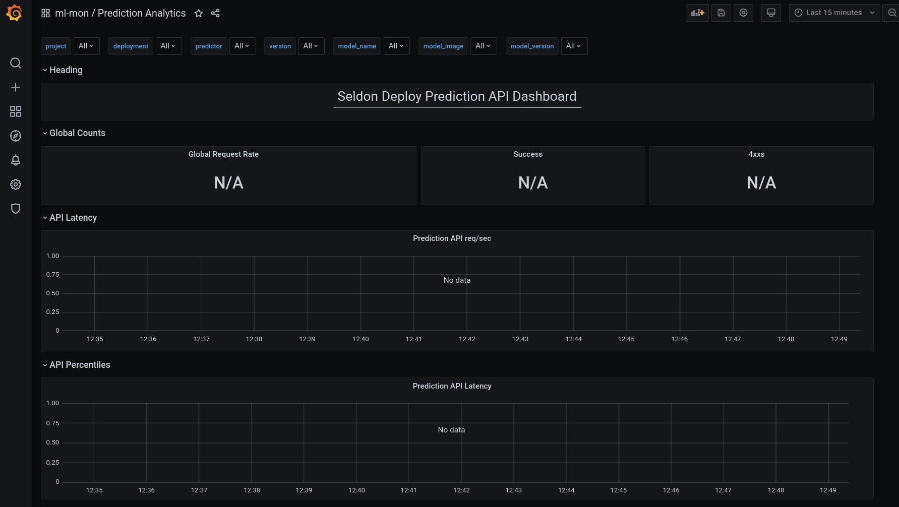
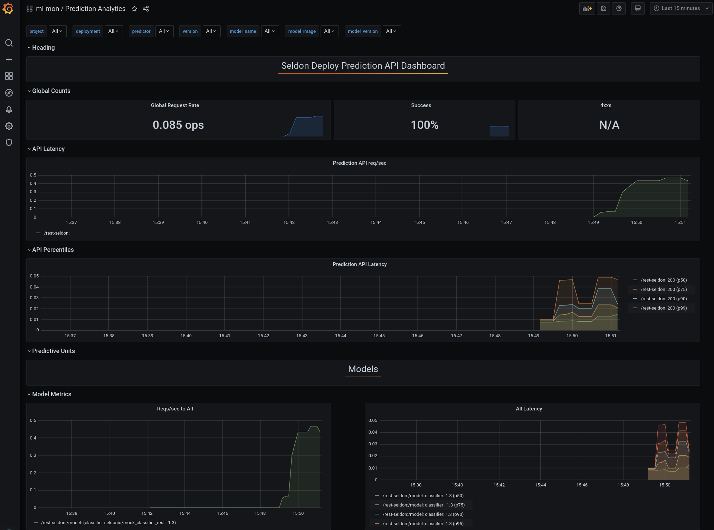
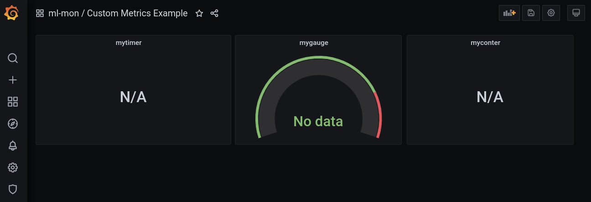

# Machine Learning Model Monitoring

### Goal
Explore how to deploy and monitor ML models on OpenShift using Seldon Core, Prometheus and Grafana. 

### Topics

* Install Seldon Core, Prometheus and Grafana
* Deploy ML models, scrape and graph operational metrics
* Scrape and graph custom metrics


# Install Seldon Core, Prometheus and Grafana

Below are step-by-step instruction for installing and configuring Seldon Core, Prometheus and Grafana. Alternatively, you can install these components with [Open Data Hub](http://opendatahub.io). 

Create a new project:

```
oc new-project ml-mon
```

## Install the Operators

Install the Operators for Seldon Core, Promentheus and Grafana via the OperatorBun in OpenShift Console or `oc` CLI. E.g.,

```
oc apply -k operator/
```


## Create a Prometheus instance and route

```
oc apply -f prometheus-instance.yaml
oc apply -f prometheus-route.yaml
```

## Configure Grafana

Create a Grafana instance:

```
oc apply -f grafana-instance.yaml
```


Create a datasource for Prometheus:

```
oc apply -f grafana-prometheus-datasource.yaml
```


Check the route and get the URL for the Grafana dashboard:

```
oc get routes
```
Sample output:

```Generate load and view the dashboard
NAME              HOST/PORT                                 PATH   SERVICES              PORT      TERMINATION   WILDCARD
grafana-route     grafana-route-ml-mon.apps-crc.testing            grafana-service       3000      edge          None
grafana-service   grafana-service-ml-mon.apps-crc.testing          grafana-service       grafana                 None
prometheus        prometheus-ml-mon.apps-crc.testing               prometheus-operated   web                     None
```

```
echo  http://$(oc get route grafana-service -n ml-mon -o jsonpath='{.spec.host}')
```

Sample output:

```
http://grafana-service-ml-mon.apps-crc.testing
```


# Deploy ML models, scrape and graph operational metrics

This this section we will use examples from SeldonIO to deploy ML models, scrape and graph operational metrics.

Ensure you are in the right namespace:
```
oc new-project ml-mon
```

## Deploy the Seldon Core Grafana Dashboard

```
oc apply -f prediction-analytics-seldon-core-1.2.2.yaml
```

Open Grafana and have a look the Prediction Analytics dashboard. No data is available yet:



## Seldon Protocol REST Model

Next we will do a couple of steps:
* Deploy a ML model using Seldon
* Expose the prediction service
* Deploy a Prometheus Service Monitor
* Generate load and view the dashboard

### Deploy a ML model using Seldon

Let us use an example from [Seldon Core](https://docs.seldon.io/projects/seldon-core/en/v1.2.2_a/examples/metrics.html#Seldon-Protocol-REST-Model):

```
oc apply -f https://raw.githubusercontent.com/SeldonIO/seldon-core/release-1.2.2/notebooks/resources/model_seldon_rest.yaml
```

Wait until the pods is deployed:
```
oc get pods
```
Sample output:
```
NAME                                              READY   STATUS    RESTARTS   AGE
...
rest-seldon-model-0-classifier-5594bd9d49-pld7s   2/2     Running   0          91m
...
```

### Expose and test the prediction service

Expose the created service so that we can test the prediction.
```
oc expose service rest-seldon-model
```

Note, Seldon created two services: ```rest-seldon-model``` and ```rest-seldon-model-classifier```
We will use here the service ```rest-seldon-model```, because it point to the seldon engine.


Test the prediction service:

```
curl  -H "Content-Type: application/json" -d '{"data": {"ndarray":[[1.0, 2.0, 5.0]]}}' -X POST http://$(oc get route rest-seldon-model  -o jsonpath='{.spec.host}')/api/v1.0/predictions 
```
Sample output:
``` 
{"data":{"names":["proba"],"ndarray":[[0.43782349911420193]]},"meta":{}}
```
The prediction works and the result is 0.437.


### Deploy a Prometheus Service Monitor
Now we will instruct Prometheus to gather Seldon-core metrics for the model. This is done with a Prometheus Service Monitor:

```
oc apply -f rest-seldon-model-servicemonitor.yaml
```

The Service Monitor is going to find the service with the label ```seldon-app=rest-seldon-model``` and scrape metrics from ```/prometheus``` at port ```http```:

```
spec:
  endpoints:
  - interval: 30s
    path: /prometheus
    port: http
  selector:
    matchLabels:
      seldon-app: rest-seldon-model
```

### Generate load and view the dashboard

Next, generate some load to have metric data on the dashboard:
```
while true
do
  curl  -H "Content-Type: application/json" -d '{"data": {"ndarray":[[1.0, 2.0, 5.0]]}}' -X POST http://$(oc get route rest-seldon-model  -o jsonpath='{.spec.host}')/api/v1.0/predictions 
  sleep 2
done

```
The Grafana  Prediction Analytics dashboard will start showing some data




## Deploy and monitor a Tensorflow model

Let us repeat the lab with a Tensorflow model from [Seldon Core](https://docs.seldon.io/projects/seldon-core/en/v1.2.2_a/examples/metrics.html#Tensorflow-Protocol-REST-Model):

### Deploy a ML model using Seldon

```
oc apply -f https://raw.githubusercontent.com/SeldonIO/seldon-core/release-1.2.2/notebooks/resources/model_tfserving_rest.yaml
```

Wait until the pods is deployed:
```
oc get pods
```
Sample output:
```
NAME                                                  READY   STATUS    RESTARTS   AGE
...
rest-tfserving-model-0-halfplustwo-7c6c67fcbc-q6rrk   2/2     Running   0          107s
...
```

### Expose and test the prediction service

Expose the created service so that we can test the prediction.
```
oc expose service rest-tfserving-model
```

Note, Seldon created two services: ```rest-tfserving-model``` and ```rest-tfserving-model-halfplustwo ```
We will use here the service ```rest-tfserving-model```, because it point to the seldon engine.


Test the prediction service:

```
curl  -H "Content-Type: application/json" -d '{"instances": [1.0, 2.0, 5.0]}' -X POST http://$(oc get route rest-tfserving-model -o jsonpath='{.spec.host}')/v1/models/halfplustwo/:predict
```
Sample output:
``` 
{
    "predictions": [2.5, 3.0, 4.5
    ]
}
```
The prediction works fine! 


### Deploy a Prometheus Service Monitor
Now we will instruct Prometheus to gather Seldon-core metrics for the model. This is done with a Prometheus Service Monitor:

```
oc apply -f rest-tfserving-model-servicemonitor.yaml
```

The Service Monitor is going to find the service with the label ```rest-tfserving-model``` and scrape metrics from ```/prometheus``` at port ```http```:

```
spec:
  endpoints:
  - interval: 30s
    path: /prometheus
    port: http
  selector:
    matchLabels:
      seldon-app: rest-tfserving-model
```

### Generate load and view the dashboard

Next, generate some load to have data on the dashboard:
```
while true
do
  curl  -H "Content-Type: application/json" -d '{"instances": [1.0, 2.0, 5.0]}' -X POST http://$(oc get route rest-tfserving-model -o jsonpath='{.spec.host}')/v1/models/halfplustwo/:predict 
  sleep 2
done

```
The Grafana Prediction Analytics dashboard will start showing the Tensorflow data. You might have to reload the dashboard.


# Scrape and graph custom metrics

Again. let's repeat the lab with a model from [Seldon Core](https://github.com/SeldonIO/seldon-core/blob/v1.2.2/examples/models/custom_metrics/model_rest.yaml).

### Deploy the model and dashboard

Deploy the example model with custom metrics

```
oc apply -f https://raw.githubusercontent.com/SeldonIO/seldon-core/v1.2.2/examples/models/custom_metrics/model_rest.yaml

```

Deploy a custom dashboard:
```
oc apply -f custom-metrics-dashboard.yaml
```

Open Grafana and have a look the Custom Metrics dashboard. No data is available yet:




### Expose service and test

```
oc expose service seldon-model-example
```

Test the prediction service:

```
curl -s -d '{"data": {"ndarray":[[1.0, 2.0, 5.0]]}}'    -X POST http://$(oc get route seldon-model-example -o jsonpath='{.spec.host}')/api/v1.0/predictions    -H "Content-Type: application/json"

```

Sample output with custom metrics in "meta":
``` 
{"data":{"names":["t:0","t:1","t:2"],"ndarray":[[1.0,2.0,5.0]]},"meta":{"metrics":[{"key":"mycounter","type":"COUNTER","value":1},{"key":"mygauge","type":"GAUGE","value":100},{"key":"mytimer","type":"TIMER","value":20.2}]}}
```

### Scrape custom metrics

**Note,** custom metrics are expose by the predictor (not the engine) at port 6000.

Therefore, add a service for port 6000:

```
oc apply -f seldon-model-example-classifier-metrics-service.yaml 
```

And add a service monitor for the custom metrics:

```
oc apply -f seldon-model-example-classifier-servicemonitor.yaml
```

Create a bit of load:
```
for i in 1 2 3 4 5
do

  curl -s -d '{"data": {"ndarray":[[1.0, 2.0, 5.0]]}}'    -X POST http://$(oc get route seldon-model-example -o jsonpath='{.spec.host}')/api/v1.0/predictions    -H "Content-Type: application/json"
  sleep 1
done
```

The Custom Metrics dashboard willhopefully show the data:


# Troubleshooting

In case your data is not showing up in Grafana, please check first in Prometheus if the metrics and data exist.

